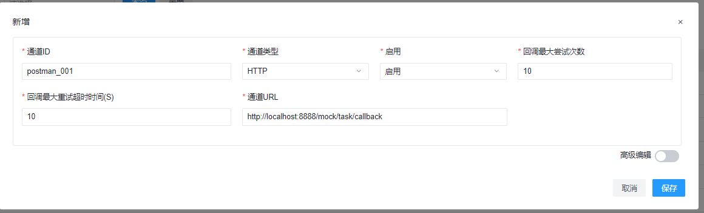

```aidl
          _____ _____   _____                       
    /\   |  __ \_   _| |  __ \                      
   /  \  | |__) || |   | |  | | ___ _ __ ___   ___  
  / /\ \ |  ___/ | |   | |  | |/ _ \ '_ ` _ \ / _ \ 
 / ____ \| |    _| |_  | |__| |  __/ | | | | | (_) |
/_/    \_\_|   |_____| |_____/ \___|_| |_| |_|\___/ 
                                                    
```

# Introduction
Demo for request RMS and process callback message from RMS

# Technology stack
springboot

# Quick Start
## Modify the configuration file application.properties if required
There are only 3 properties in this file
```aidl
# your application web port 
server.port=8888
# RMS server http port
rms.http.host=http://127.0.0.1:8895
# mock shelf or tote stay time in station, unit is seconds
station.stay.time=5
```
## Add HTTP callback url for this application
```aidl
http://localhost:8888/mock/task/callback

```
## Start application
### Bootstrap java class
```
com.geekplus.demo.api.GeekplusDemoApplication
```
### Demo java classes
```aidl
com.geekplus.demo.api.demo.*
```